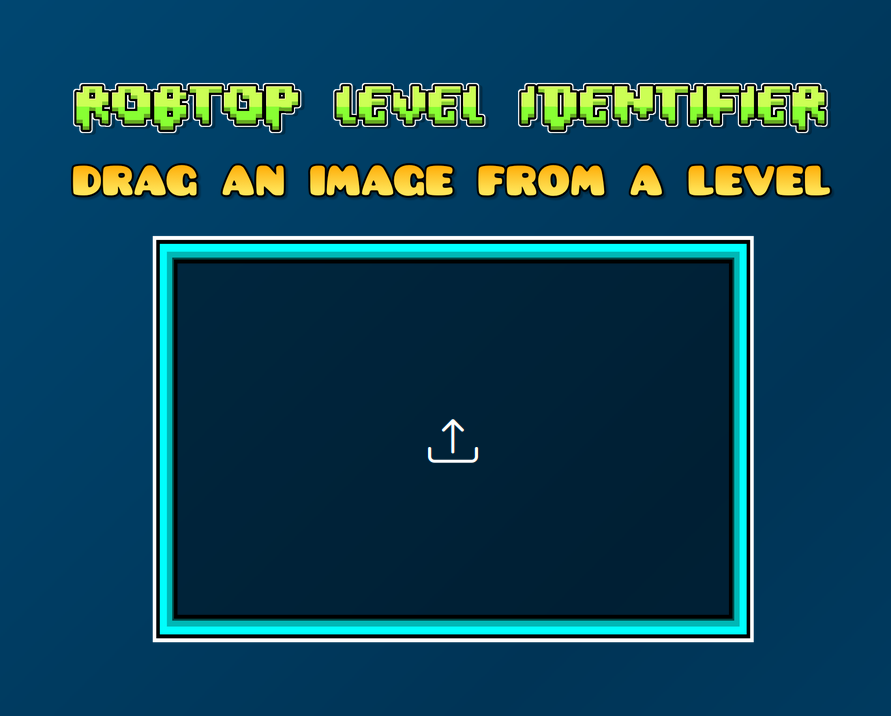

  


---


<div align="center">
  <h2>Model capable of identifying all levels of Robtop (Geometry Dash :p) 🤖</h2> 
  
</div>

---

## EN🇬🇧 
### Development process📝  
A few months ago, as I began exploring the field of artificial intelligence, I wondered whether it would be possible to develop a model capable of recognizing Geometry Dash levels. My goal was not to exploit this for unfair advantage in Sparky, especially considering the evident hardware limitations—even when utilizing cloud resources. Ultimately, I decided to base the project on the pre-trained MobileNetV2 model from Keras, leveraging convolutional neural networks for image recognition. The complete code can be found in the repository [GDLvlDetector](https://github.com/ANGELUSD11/GDLvlDetector/). Initially, I attempted to build the network from scratch using TensorFlow, which surprisingly performed quite well in recognizing around two to five levels at most. However, the primary challenge with this approach was the sheer volume of data required and the hardware constraints. In the following sections, I will explain each phase of the training process I undertook.  

---

- Step 1: Data Collection  
As with any machine learning project, the initial step that must be taken—and the one that will ultimately determine the quality of the model—is gathering the training data. For this project, I spent several days recording all the levels that the model would later recognize using images. However, I could not train the model using video footage directly, which leads us to the second step. 

- Step 2: Frame Extraction  
The proper way to train a convolutional neural network is by using images. Therefore, I extracted frames from the videos I had recorded earlier. Naturally, I didn’t do this manually but instead used OpenCV with the following script:  
```python
import os
import cv2

def extract_frames(video_path, output_folder, interval=30):
    os.makedirs(output_folder, exist_ok=True)

    cap = cv2.VideoCapture(video_path)

    frame_count = 0
    saved_frames = 0

    while cap.isOpened(): 
        ret, frame = cap.read()
        if not ret:
            break

        if frame_count % interval == 0:
            filename = os.path.join(output_folder, f"{os.path.basename(video_path).split('.')[0]}_frame_{saved_frames}.jpg")
            cv2.imwrite(filename, frame)
            saved_frames += 1

        frame_count += 1

    cap.release()
```
